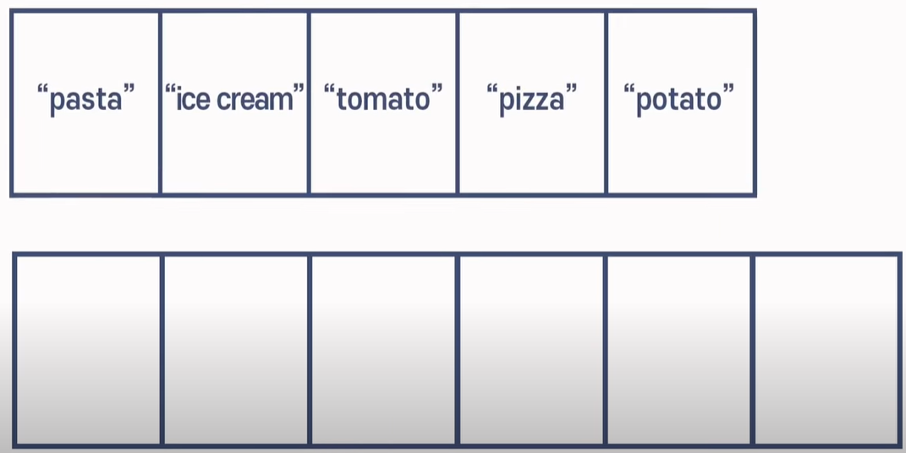

# **Array**

## 1. **메모리 관점**
### 1.1. **메모리 종류**
- 메모리엔 volatile(휘발성), non-volatile(비휘발성) 2가지 종류가 있다. HDD는 비휘발성, RAM은 휘발성이다. 프로그램이 돌아가고 변수를 생성하면 RAM에 저장된다.
-  HDD보다 RAM의 데이터에 접근하는 것이 더 빠르다. 왜냐하면 RAM(Random Access Memory)은 이름처럼 데이터에 랜덤으로 접근할 수 있기 때문이다.  
(여기서 랜덤이란 무작위로 접근한다는 것이 아닌 원하는 곳으로 접근 가능함을 뜻함)  

   
 
### 1.2. **Array와 메모리**
- 배열을 만들 때 컴퓨터에게 배열의 길이를 알려 메모리 공간을 예약/할당한다. 
- 시작주소를 기준으로 나란히 위치하게 된다.
- javascript의 경우 javascript 엔진이 우리 대신 핸들링 해 편리하다. 대가로 직접 핸들링하는 C와 같은 언어에 비해 느리다.  

   

## 2. **[시간복잡도 관점](https://github.com/swywssaid/TIL/blob/main/algorithm/time-complexity.md)**
**Operations (READ, SEARCH, INSERT, DELETE)**  
 

### 2.1. **READ (읽기)**
- 배열은 배열의 크기만큼 메모리 공간이 할당되면 시작주소를 기준으로 각 주소들과 index가 매칭된다.
- RAM의 Random Access 덕분에 index를 통해 바로 접근 가능하다.

   

### 2.2. **SERCH (검색)**
- 주소를 통해 접근은 가능하지만 데이터가 어디에 있는지 모르기 때문에 일일이 다 찾아야 한다.
- 배열의 시작주소부터 데이터를 확인한다. 이런 것을 Linear Search(선형 검색)이라고 한다.
> 배열 검색을 빠르게 하는 다른 방법 학습 예정. 일단은 배열 내 검색은 그닥 빠르지 않다 정도로 알자.

  

### 2.3. **INSERT (삽입)**
**case1. 마지막에 추가 (메모리 공간을 확보해두었다고 가정)**
- 그냥 마지막에 추가하면 됨으로 빠르다.

 

**case2. 중간/맨앞에 추가 (메모리 공간을 확보해두었다고 가정)**
- "tomato"를 "ice cream" 옆에 추가하는 과정이다. 
    1. "potato"를 index 4로 옮긴다.
    2. "pizza"를 index 3으로 옮긴다.
    3. "tomato"를 index 2에 추가한다.
- 배열의 크기가 크다면 굉장히 비효율적.  

  

**case2. 메모리 공간 미확보 시 추가**
- 메모리공간을 재확보하고 요소를 복사한 뒤 작업한다.
- 굉장히 비효율적 

  

### 2.4. **DELETE (삭제)**
**case1. 마지막 요소 삭제**
- 컴퓨터는 메모리 주소가 어디서부터 어디까지인지 기억하기 때문에 마지막 index 요소를 제거한다.
  
  

**case2. 중간/맨앞 요소 삭제**
- 중간 요소를 제거하면 공백을 메워야한다.
- "pizza"를 제거 후 공백을 메우는 과정이다.
    1. "pizza"를 제거한다.
    2. "potato"를 index 3으로 옮긴다.
    3. "kimchi"를 index 4로 옮긴다.

    

>읽기는 굉장히 빠르지만 검색, 삽입, 삭제 시 조금 느리다. 그땐 맨 배열 마지막에서 작업하는 것을 추천.

   

## 3. **Reference**
[알고리즘.데이터구조 with Nico](https://www.youtube.com/watch?v=NFETSCJON2M&list=PL7jH19IHhOLMdHvl3KBfFI70r9P0lkJwL&index=2)