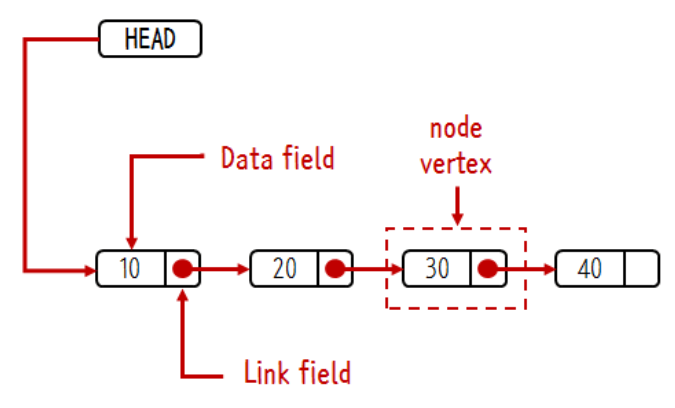
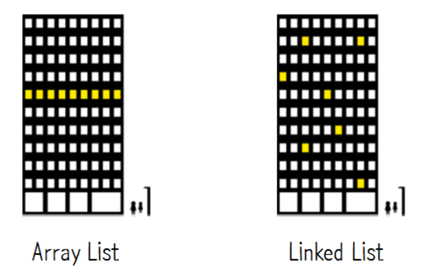

linked list

## linked list (연결 리스트)
- 각 값이 노드를 이루고 있으며 각 노드는 다음 노드를 가리키고 있는 자료구조.
  - 각 노드는 자신의 값과 다음 노드를 가리키는 포인터를 갖고 있음.



<br>

>리스트(list)란?  
선형적으로(순서가 존재한다는 뜻) 값들을 가지고 있는 자료구조.  
흔히 [①배열(array)](https://github.com/swywssaid/TIL/blob/main/data-structure/array.md)과 ②연결 리스트(linked list)로 나뉨.

<br><br>

## linked list (연결 리스트) 구현
- 기본적인 연결 리스트를 구현해보자.
  - 여기서 기본적이라 함은 별도의 용도로 만든 포인터가 없는 경우를 말한다.
  
```javascript
// node class 
class Node {
    // constructor
    constructor(element)
    {
        this.element = element;
        this.next = null
    }
}

// linkedlist class
class LinkedList {
    // constructor
    constructor()
    {
        this.head = null;
        this.length = 0;
    }
 
    // functions to be implemented
    // add(element)
    // insertAt(element, location)
    // removeFrom(location)
    // removeElement(element)
 
    // Helper Methods
    // isEmpty
    // size_Of_List
    // PrintList
}
```
<br><br>

### add(element)
- 리스트의 마지막에 요소를 추가.
- 아래 두가지 상황을 고려해야함
  1. 리스트가 비어있는 경우
       - 추가하는 노드가 head가 됨
  2. 리스트가 비어있지 않은 경우
       - 끝으로 이동 후 마지막 노드의 next가 추가하는 노드 됨. 
- head 포인터만 갖고 추가할 경우 O(N)의 시간 걸림.
  - 만약 마지막 값을 가리키고 있는 tail 포인터 사용 시 O(1).

```javascript 
// LinkedList 클래스에 추가
add(element)
{
  // 노드 생성
  let node = new Node(element);

  // 현재 노드 생성, 여기서 현재 노드란 끝으로 이동하기 위한 임시 노드.
  let current;

  if (this.length === 0){
    this.head = node;
  } else {
    // 제일 앞 부분 노드가 현재 노드가 됨.
    current = this.head;

    // 제일 앞 노드 부터 끝으로 이동, 끝 노드의 next는 null
    while(current.next){
      current = current.next;
    }

    // 마지막 노드의 next가 추가할 노드 가리킴.
    current.next = node;
   
  }

  // 연결리스트 사이즈 키움
    this.length++;
}
``` 
### insertAt(element, location)
- 특정 인덱스에 노드 삽입 기능.
- 아래 세가지 상황을 고려해야함.
  1. 제일 앞에 삽입할 경우
     - 삽입할 노드가 head가 됨
  2. 제일 끝에 삽입할 경우
     - add() 작업과 동일
  3. 1,2를 제외한 중간에 삽입할 경우
     - 삽입할 노드의 next를 curr를 가리킨다.
     - prev.next는 삽입할 노드를 가리킨다.

```javascript
 insertAt(element, location) {
    if (location < 0 || location > this.length) return console.log("Please enter a valid location.");

    // 노드 생성
    let node = new Node(element);

    let curr = this.head;
    let prev;

    // 제일 앞에 삽입할 경우
    if (location === 0) {
      node.next = this.head;
      this.head = node;
    } /*else if (location === this.length) {      해당 조건은 아래 코드에 포함돼 생략하고 해결 가능.
      return this.add(element);
    }*/else {
      for (let i = 0; i < location; i++) {     
        prev = curr;
        curr = curr.next;  // 만약 리스트 마지막에 삽입 시 curr.next === null
      }

      node.next = curr;
      prev.next = node;
    }

    this.length++;
  }
```


## Array VS Linked List



## Reference <!-- omit in toc -->

[리스트(List), 배열(Array), 연결 리스트(Linked List)](https://blog.naver.com/PostView.naver?blogId=kks227&logNo=220781402507&parentCategoryNo=&categoryNo=299&viewDate=&isShowPopularPosts=false&from=postList)

[Linked List](https://opentutorials.org/module/1335/8821)

[Implementation of LinkedList in Javascript](https://www.geeksforgeeks.org/implementation-linkedlist-javascript/)